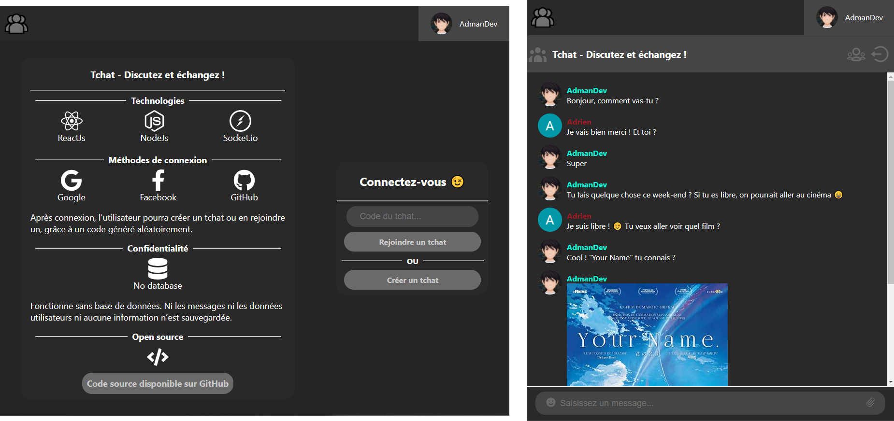

# Web Tchat Application

This project is a chat that allows to discuss with your friends, after creating a private room.

You can test this application here : https://app.admandev.fr/tchat

**Documentation :**

* [Technologies](#technologies)
* [Features](#features)
* [Login system](doc/login.md)
* [Chat socket events](doc/socket_events.md)
* [Install and run](doc/install.md)

## Technologies

---

* ReactJs
* NodeJs
* [Socket.IO](https://socket.io/) library

**Note :**

* This application doesn't use database. So messages, users data, and any information will be not saved.

**Importante :**

* Note that the back and the front comunicate with Socket.IO library only. There are not HTTP request between them.

* A message between the app and the server is represented by the name of message and data to transmit.

## Features

---

* Login with Google, Facebook or GitHub API
* Create or join a chat room with a generated code
* Send textual messages, images or any file (less than 100 Ko)
* Use emojis
* More features are coming soon
